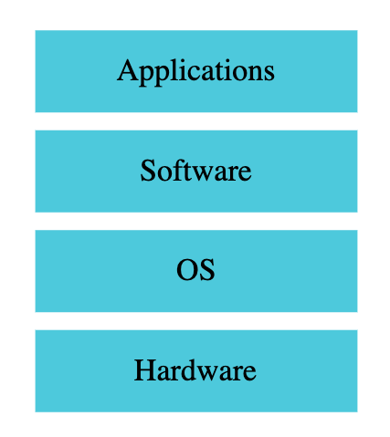
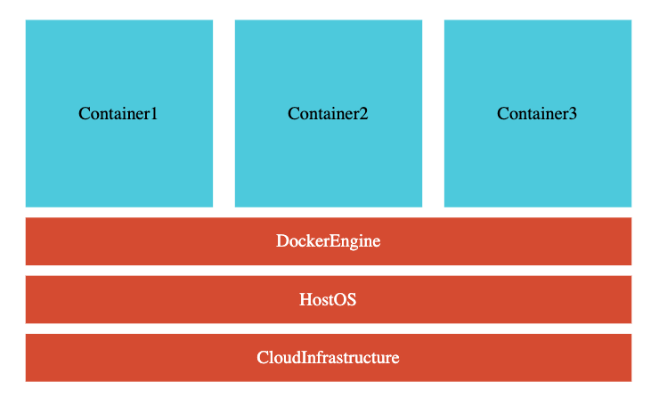
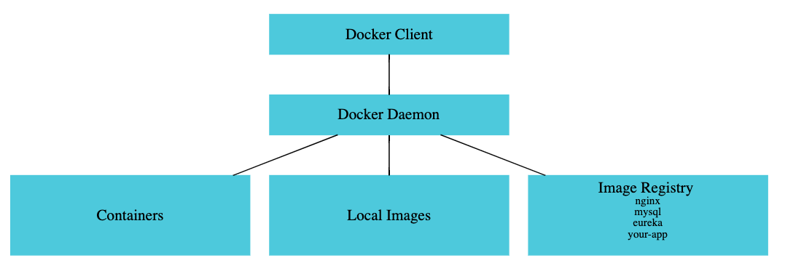

# Docker in 5 Steps

Let's learn Docker in 5 Easy Steps. 

- Step 00 - Installing Docker
- Step 01 - A simple Docker use case - Run an existing application
- Step 02 - Playing with Docker - Containers and Images
- Step 03 - How does Docker work?
- Step 04 - Manually creating a docker image
- Step 05 - Dockerizing a Spring Boot Application using Dockerfile and Spotify Maven Plugin

### Step 00 - Installing Docker

- https://docs.docker.com/install/

### Step 01 - Run Sample docker examples

- Find docker example applications under examples folder

#### Traditional Deployment



#### Deployment with Docker




### Step 02 - Playing with Docker - Containers and Images

- Image is static
- Container is dynamic

```
  Create the docker image:
  docker build -f Dockerfile  -t docker-spring-boot .(current directory)
  Push the image:
  docker push p_akula/docker-spring-boot:1.0.0
  docker run p_akula/docker-spring-boot:1.0.0.RELEASE
  docker run -p 8080:8080 ms/docker-spring-boot:1.0.0.RELEAS
  docker images
  docker containers 
  docker containers ls
  docker container ls -l
  docker container ls -a
  docker container start fed549e69e9d
  docker container stop tender_ardinghelli
  docker container start c165f459e7d7
  docker container stop 151a77679241
  docker container logs c165f459e7d7
  docker container rm fed549e69e9d
  docker container prune
  docker container inspect 0967ba7aa180
  docker image history f8049a029560
  docker image remove f8049a029560
```

### Step 03 - How does Docker work?

#### Docker Architecture



### Step 04 - Manually creating a new docker image

docker build -f Dockerfile  -t docker-spring-boot .(current directory)

### Step 05 : Containerizing Spring Boot Application using Dockerfile and Spotify Maven Plugin

Run docker-spring-boot as a Java Application.

- mvn package
- docker run -d -p 8000:8000 p_akula/docker-spring-boot:1.0.0.RELEASE
- docker login
- docker push p_akula/docker-spring-boot:1.0.0.RELEASE

#### Troubleshooting

- Problem - Caused by: com.spotify.docker.client.shaded.javax.ws.rs.ProcessingException: java.io.IOException: No such file or directory
- Solution - Check if docker is up and running!
- Problem - Error creating the Docker image on MacOS - java.io.IOException: Cannot run program “docker-credential-osxkeychain”: error=2, No such file or directory
- Solution - https://medium.com/@dakshika/error-creating-the-docker-image-on-macos-wso2-enterprise-integrator-tooling-dfb5b537b44e

```
docker login
```


